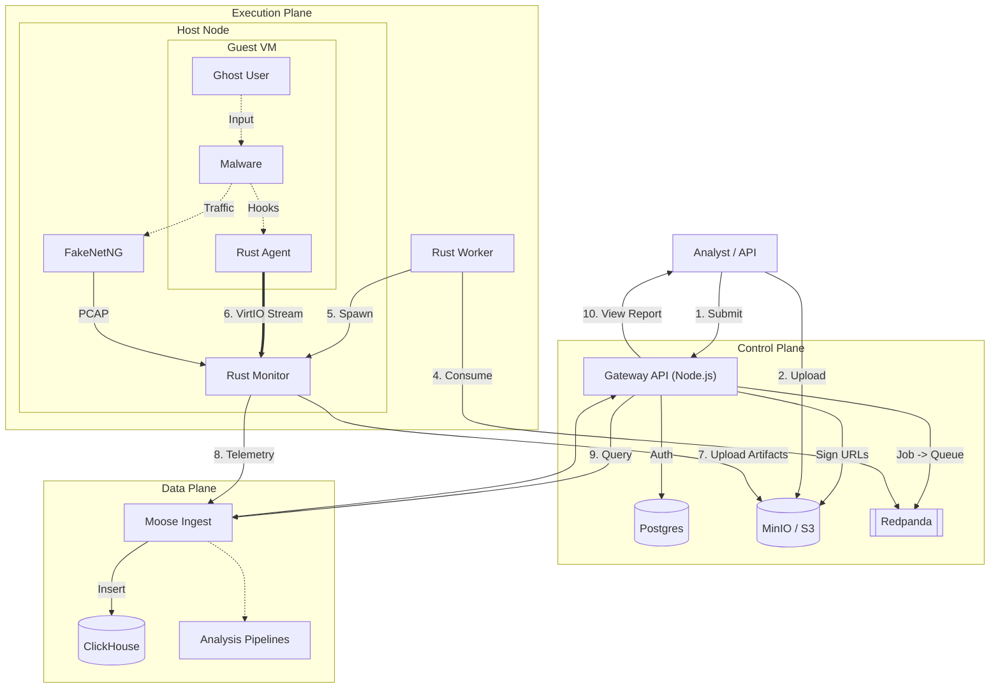

# Loonaro

Loonaro is a malware sandbox designed for high-throughput enterprise environments. It is built to serve as a scalable, secure analysis platform, capable of deployment as a unified SaaS or an air-gapped on-premise solution.

It's split into two main parts: a **Control Plane** (Node.js) that handles orchestration, auth, and billing, and a **Runtime** (Rust) that performs the secure detonation and instrumentation.

## Architecture

We use a "Control Plane / Data Plane" split to ensure the API remains responsive regardless of the volume of analysis artifacts being processed.

### How a job runs

1.  **Submission**: You POST a job to the Gateway. We check your quota in Postgres.
2.  **Upload**: You get a presigned S3 URL to upload your binary. We do this to prevent the API from becoming a bottleneck with large files. **Storage is Encrypted at Rest (AES-256).**
3.  **Queue**: Once the file is in S3, we push a job event to Redpanda.
4.  **Worker**: A Rust worker picks up the job. It is stateless and decoupled from the API.
5.  **Detonation**: The worker spawns a **Monitor** process which starts the VM (QEMU).
6.  **Network Behavior**:
     - Block: sandbox network disabled, no traffic
     - Simulate: fakenet-ng intercepts and fakes responses with user-provided rules
     - Allow: real network (dangerous, use with caution)
7.  **Collection**: The trusted Monitor streams heavy artifacts (memory dumps, PCAP, Dropped Files) **directly to S3**.
8.  **Analysis**: Telemetry flows into Moose (ClickHouse) where we run:
    *   **Yara**: Pattern matching on files/memory.
    *   **Sigma**: Behavioral detection on events.
    *   **MITRE ATT&CK**: Automated mapping of behaviors to TTPs.

## Tech Stack

*   **Gateway**: Node.js/TypeScript. Chosen for rapid API development and ecosystem integration (Stripe, Auth).
*   **Runtime**: 100% Rust. Chosen for memory safety, reliability, and low-level system control (Hypervisor interaction, VirtIO).
*   **Data**: Moose + ClickHouse. Chosen for high-ingest capability and analytical query performance on syscall data.

## Key Capabilities & Scalability

*   **Interactive Analysis (VNC)**: Connect to a live session via the browser. The Monitor tunnels VNC traffic through the Gateway.
*   **User Simulation (Ghost)**: The agent moves the mouse, clicks dialogs, and types to mitigate basic anti-sandbox techniques.
*   **Static Analysis**: Before detonation, we extract PE Headers, Imports, and Strings for an immediate "Pre-Flight" report.
*   **Artifact Offloading**: Large artifacts (Memory Dumps) are uploaded directly to S3 via Presigned URLs, bypassing the API layer completely.
*   **Horizontal Scaling**: Throughput can be increased by adding more Rust Worker nodes, which act as competing consumers on the job queue.

## Observability

We prioritize production visibility:

*   **Metrics**: Prometheus endpoints on Gateway and Workers (`jobs_active`, `queue_lag`, `ingest_rate`).
*   **Logs**: Structured JSON logging (Pino) forwarded to centralized logging (ELK/Splunk).
*   **Tracing**: Request IDs follow the job from API -> Queue -> VM -> Moose.
*   **Audit**: Every download of a malware sample is logged to Postgres for compliance.

## Monetization & Deployment

We support two modes via the `DEPLOYMENT_MODE` env var:

**SaaS Mode (Cloud)**:
*   Multi-tenant with Stripe billing.
*   Public feed of malware scans.

| Feature | Community (Free) | Pro ($29/mo) | Team ($199/mo) |
| :--- | :--- | :--- | :--- |
| **Visibility** | Public Only | Private Available | Private / Team |
| **Timeout** | 60s | 5 Min | 20 Min |
| **Daily Limit** | 10 Scans | 500 Scans | 5,000 Scans |
| **Artifacts** | Screenshots | MemDumps, PCAP | Everything |
| **Retention** | 24 Hours | 30 Days | 90 Days |

**On-Prem Mode (Enterprise)**:
*   Air-gapped (No internet needed).
*   **Offline Licensing**: Uses a signed JWT license key (validated by public key).
*   **Identity**: Connects to your AD/LDAP.
*   **BYO Infra**: Runs on your vSphere/ESXi cluster.

## Project Structure

*   `gateway/`: The Node.js API server (Express + Prisma).
*   `runtime/`: The Rust magic (Agent, Monitor, Worker).
*   `moose/`: The Data Engineering logic (ClickHouse schemas, Pipelines).
*   `client/`: React frontend.
